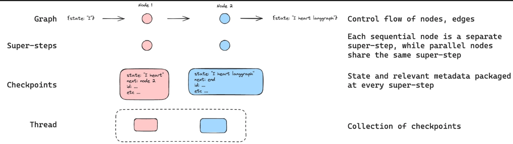

  ```python
  messages = [HumanMessage(content="Add 3 and 4.")]
  messages = react_graph.invoke({"messages": messages})
  for m in messages['messages']:
      m.pretty_print()
  ```

  ```python
  messages = [HumanMessage(content="Multiply that by 2.")]
  messages = react_graph.invoke({"messages": messages})
  for m in messages['messages']:
    m.pretty_print()
  ```

1. The issue in the code arises from the lack of retaining memory between interactions.

2. Without memory retention, the agent treats each input as a standalone prompt, so when we ask it for "multiply that by 2," the agent doesn’t have access to the result of the previous addition (3 + 4 = 7) unless explicitly provided again.
This results in the failure to continue the logical sequence of tasks.

 ```python
  from langgraph.checkpoint.memory import MemorySaver
  memory = MemorySaver()


  react_graph_memory = builder.compile(checkpointer=memory)
  ```

  ```python
  # Specify a thread
  config = {"configurable": {"thread_id": "1"}}

  # Specify an input
  messages = [HumanMessage(content="Add 3 and 4.")]

  # Run
  messages = react_graph_memory.invoke({"messages": messages},config)
  for m in messages['messages']:
      m.pretty_print()
  ```




3. The "thread_id" is used to identify and group related interactions.
It acts as a key or identifier for storing and retrieving memory (graph states) associated with a particular session or conversation thread.
4. Multiple sessions or conversations can be tracked independently by assigning unique thread_ids.
5. At every step in the conversation or task execution, the state of the graph (the computation or decision flow) is checkpointed (saved).
6. All the checkpoints for a specific thread of interaction are saved in memory associated with the thread_id.
7. This means that every interaction in the same thread has access to the memory of previous states, allowing continuity in conversation.

:::tip
1. For more understanding regarding memory, check out this:  [Memory - Long term memory, Short term memory](https://langchain-ai.github.io/langgraph/concepts/memory/)
:::

  ```python
  messages = [HumanMessage(content="Multiply that by 2.")]
  messages = react_graph_memory.invoke({"messages": messages}, config)
  for m in messages['messages']:
      m.pretty_print()
  ```

8. By adding MemorySaver, we can enable the agent to remember the result of the previous operation (7 in this case) and
use it in the next step. The agent can then correctly interpret "Multiply that by 2" as multiplying 7 by 2, giving the right answer.