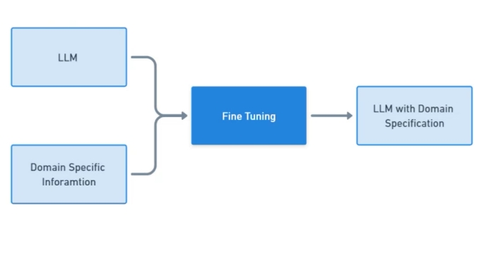

# Fine tuning & models (Introduction)

## **What is fine tuning?**

1. Fine-tuning involves customizing a pre-trained LLM by training it on a specific, domain-related dataset. The method adjusts the model’s internal parameters, allowing it to better align with specialized tasks, content styles, or industries.

2. Fine-tuning excels in cases where deep customization and context-specific understanding are crucial.  

3. By training on specific data, fine-tuned model can deliver accurate and detailed results that general models finds hard to produce.

4. Retraining the model by adjusting Weights and bias know as Parameters

5. Whenever we fine tune, we wont Fine tune all the parameters we Change only required parameters.

## **RAG vs finetuning?**

1. RAG combines information retrieval with generative models to generate responses based on both the input query and external knowledge.  

2. Fine-tuning involves modifying a pre-trained model by training it further on specific tasks or data, allowing it to specialize in certain domains or applications.

:::tip 
To learn more about - [RAG vs Fine-Tuning](https://medium.com/aidetic/prompt-engineering-vs-rag-vs-finetuning-whats-the-difference-78466d70b5df)
:::

### **Story**

1. Imagine you're taking an open book exam. During the test, you can refer to your textbook whenever you need help answering a question.

2. This is similar to how RAG works. When the model is asked something, it retrieves information from an external source, like looking up the right answer in a book, and then uses that information to respond.
  
3. Now, think about a closed book exam. You’ve studied the material thoroughly beforehand, so you can answer the questions without needing any outside resources. This is like fine-tuning. 

4. The model is trained on specific data, and after enough practice, it knows how to handle the task on its own without needing to retrieve additional information.
