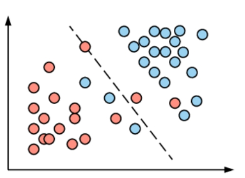
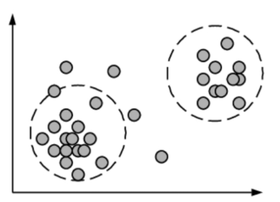
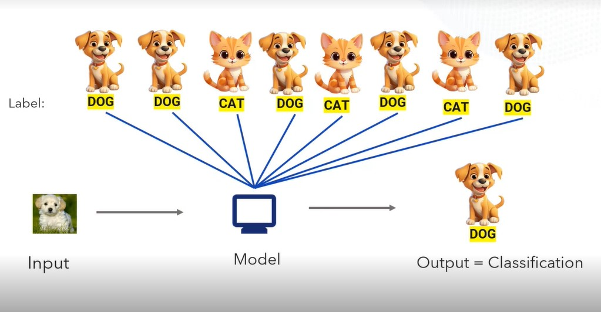

## Artificial Intelligence

1. The field of artificial intelligence arose from the idea that `machines might be able to think like humans`. 

2. This technology that allows computers and other devices to mimic human learning, comprehension, problem-solving, decision-making, creativity, and autonomy.

## Machine Learning

1. Machine learning is a subset of artificial intelligence that focuses on creating systems that can learn from data and enhance their performance without being explicitly programmed.

2. Machine learning algorithms can discover patterns, make predictions, and generate insights from data, without needing human intervention or supervision.

### Types of machine learning

### Supervised Learning

1. Supervised machine learning involves using labeled data, which means that the input data has a known output or target variable. Here the goal is to learn the mapping patterns from the input data and its labels, so that it can make accurate predictions on new, unseen data.

1. Imagine you're teaching a child to recognize different fruits. You will show the pictures of fruits like apples, bananas, and oranges, and you tell them the names of each fruit. Over time, the child learns to identify apples by their round shape and red color, bananas by their long shape and yellow color, and oranges by their round shape and orange color. After seeing enough examples, the child can then correctly name the fruits even without your help. 

2. Similarly, in supervised learning, a machine learning model is trained by showing it labeled examples (like the pictures of fruits with their names), and it learns to match patterns in the data to the correct labels.

### Un-supervised Learning

1. Unsupervised machine learning involves the input data but without any corresponding output or label. Here goal is to find patterns or structure in the data.

2. Imagine you're giving a group of children a box of mixed toys, but you don't tell them the names of the toys or what types they are. The children start sorting the toys on their own. Some group the toys by size, others by color, and some by shape. Without any instructions, they discover patterns and similarities among the toys and organize them based on those features. 

3. Similarly, in unsupervised learning, a machine learning model is given data without labels, and it figures out patterns and relationships within the data on its own, like the children grouping the toys.

## Deep Learning

1. Deep learning is a subset of machine learning that focuses on neural networks with many layers. These layers allow the model to automatically learn complex patterns and representations from large amounts of data.
2. In regular machine learning, people often have to decide which features are important, but with deep learning, the model can automatically learn both simple and complex details straight from the raw data. This makes it very helpful for tasks like identifying objects in pictures, understanding spoken words, or interpreting text.

Deep learning models widely divided into two groups:

1. Discriminative models
2. Generative models

## Discriminative Models

1. These models are focused on distinguishing between different classes or labels. They are used for classification and regression tasks where the goal is to map an input to an output label.

2. For example, if you're training a model to classify images of cats and dogs, a discriminative model focuses on learning the differences that separate cats from dogs.

3. If you show the model a new image of dog, the model will analyze the image based on what it has already learned. It will check for patterns like the shape of the ears, eye and fur texture. Since these features align with what it learned about dogs, it will classify the image as a "dog.

4. The discriminative model doesn't try to understand everything about cats or dogs in general, it only focuses on the differences that help distinguish them from each other. It "discriminates" between the two categories based on the patterns it learns, making it very efficient for classification tasks.

## Generative Models

1. A generative model is a type of model that learns from a set of data so it can create new examples that look like the original data. Instead of just figuring out, what something is or classifying it, a generative model can generate new things, like images, text, or sounds, that resemble what it learned.

2. For example, if you're training a generative model on images of dogs, As the model processes these images, it learns important features such as the shapes of ears (floppy or pointy), fur textures and colors (spotted, striped, or solid), and body sizes (large or small).
3. Through this feature extraction, the model develops a deep understanding of **what makes a dog look like a dog**.

4. Once it has learned these characteristics, the model can creatively combine different features, like taking the small ears from one breed and the fur color of another, to generate a new, synthetic dog image.
5. The resulting image is a realistic, but entirely unique dog that was not part of the original dataset, showcasing the model’s ability to generate novel data based on learned patterns.

