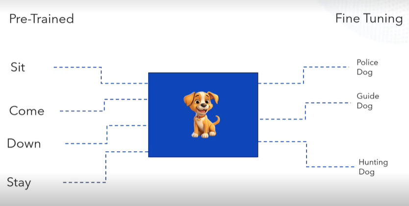
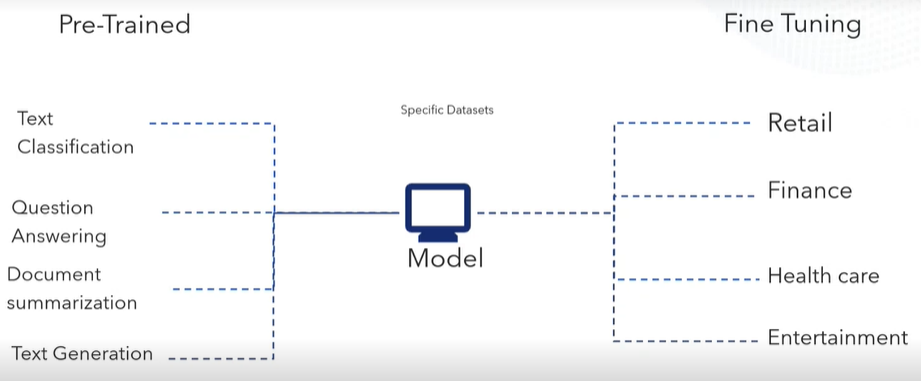

## Traditional model

## Generative model

## What is GEN AI?

1. Generative AI refers to any artificial intelligence system capable of creating new content, such as text, images, music, or even code, based on the data it was trained on.
2. Different Gen AI models are

## LLM

1. LLM's are **Large**, **general-purpose language** models can be pre-trained and then fine-tuned for specific purposes.
2. Imagine you are training a dog, often you train your dog on the basic commands like "sit","come", "down", "stay". These are some general commands that the dog trained with, for normal use-case.
3. However, If you need a special service dog such as police dog, guide dog,  hunting dog, you need to give special set of trainings to specialize in the respective tasks.

4. Similarly, Large language models are trained to solve the common problems like text classification, question answering, document summarization,text generation etc.,
5. Then these model can be fine-tuned to solve specific problems in the different fields like retail, finance and entertainment, etc..,

6. Large Language Models are designed to understand and generate human-like text based on massive amounts of data. 
7. These models are trained on vast datasets that include text from books, websites, articles, and other sources to learn the structure and patterns of language.
8. With their ability to process and generate coherent, contextually relevant text, LLMs have become prominent tools for tasks like text completion, answering questions, translation, summarization, and even conversation.
9. The most widely know LLMs are the GPT (Generative Pre-trained Transformer) series, developed by OpenAI, and BERT (Bidirectional Encoder Representations from Transformers), produced by Google. These models use the Transformer architecture, a type of neural network introduced in the paper 
[“Attention Is All You Need”](https://research.google/pubs/attention-is-all-you-need/)

